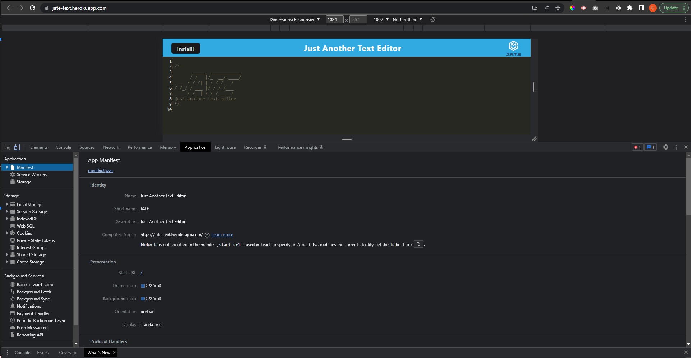

# PWA-TEXT-EDITOR

## Description

Just another Text Editor (JATE) is single page application that will be installable in the user's device, allowing the application to function offline.This is possible due a technology called PWA (Progressive Web Application) which is a website that looks and behaves as if it is a mobile app giving a fast web experience.

IndexedDB is a low-level API for client-side storage of significant amounts of structured data, this data is stored in the user's browser. This Technology helped storing text typed by the user without losing it when refreshing the page.

Babel is a technology mainly used to convert ECMAScript 2015+ code into compatible versions of Javascript that can run in current and older browsers making any web application to run properly for a better user experience.

Webpack is is a bundler for modules, its main purpose is to bundle JavaScript files for usage in a browser.

## Table of Contents (Optional)

- [Installation](#installation)
- [Usage](#usage)
- [Credits](#credits)
- [License](#license)

## Installation

This PWA requires many dependencies/packages to be install in order to work properly: 

On the client side:
- IndexedDB:
- --idb version 6.1.2

Babel:
- --babel/core version 7.15.0,
- --babel/plugin-transform-runtime version 7.15.0,
- --babel/preset-env version 7.15.0,
- --babel/runtime version 7.15.3,
- --babel-loader version 8.2.2

Webpack:
- --webpack version 5.51.1,
- --webpack-cli version 4.8.0,
- --webpack-dev-server version 4.0.0,
- --webpack-pwa-manifest version 4.3.0,
- --workbox-webpack-plugin version 6.2.4,
- --css-loader version 6.2.0,
- --html-webpack-plugin version 5.3.2,
- --http-server version 0.11.1,
- --style-loader version 3.2.1

On the server side:
- Express JS:
- --express version 4.17.1

To run the application locally, the repository has to be cloned and run the following commands in the text editor's integrated terminal:
- npm run install
- npm run start:dev

## Usage

Deployed App URL: https://jate-text.herokuapp.com/

This web application can be installed in the user's desktop by clicking the install button located in the top-left corner of the page:

Using the Chrome DevTools Console, we can see that Service Workers is activated and running, 

Application manifest information is displayed correctly,

IndexedDB works properly storing user's input, this is the way the PWA is going to give the user a better experience when using the web app offline

## Credits
- https://developer.mozilla.org/en-US/docs/Web/API/IndexedDB_API
- https://babeljs.io/docs/
- https://www.npmjs.com/package/webpack
- Tutor: Jose Lopez.

## License
MIT License

Copyright (c) [2023] [Ulises_Garfias]

Permission is hereby granted, free of charge, to any person obtaining a copy
of this software and associated documentation files (the "Software"), to deal
in the Software without restriction, including without limitation the rights
to use, copy, modify, merge, publish, distribute, sublicense, and/or sell
copies of the Software, and to permit persons to whom the Software is
furnished to do so, subject to the following conditions:

The above copyright notice and this permission notice shall be included in all
copies or substantial portions of the Software.

THE SOFTWARE IS PROVIDED "AS IS", WITHOUT WARRANTY OF ANY KIND, EXPRESS OR
IMPLIED, INCLUDING BUT NOT LIMITED TO THE WARRANTIES OF MERCHANTABILITY,
FITNESS FOR A PARTICULAR PURPOSE AND NONINFRINGEMENT. IN NO EVENT SHALL THE
AUTHORS OR COPYRIGHT HOLDERS BE LIABLE FOR ANY CLAIM, DAMAGES OR OTHER
LIABILITY, WHETHER IN AN ACTION OF CONTRACT, TORT OR OTHERWISE, ARISING FROM,
OUT OF OR IN CONNECTION WITH THE SOFTWARE OR THE USE OR OTHER DEALINGS IN THE
SOFTWARE.